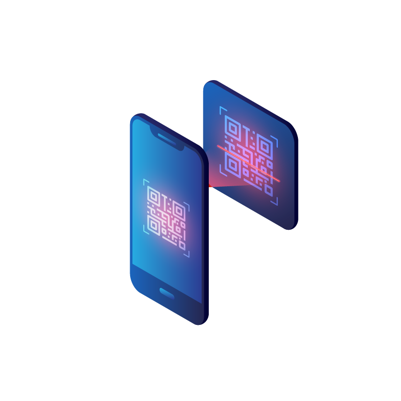

# Trash Scan&#8482;, the _App_



## Coming Soon

## Description

**Trash Scan**&#8482;, the _Device_, provides users an inexpensive way to track the items they throw away so that they can be repurchased with ease. This was a request for a family member and the user story for the scanner is as follows:

```txt
I want a device near my trash can

So that I can scan the bar codes of the grocery items I am discarding in the trash.

I want to be able to access the list of discarded items on my phone or computer

So that I can view them later for purchasing.
```

**Trash Scan**&#8482;, the _App_, provides the UI for the remaining user requirements. Ideally, **Trash Scan**&#8482;, the _App_, should be used with **Trash Scan**&#8482;, the _Device_. But the app has been expanded for general-purpose use and provides a bar code scanner via your device's camera as a back-up.

In the preliminary stages, **Trash Scan**&#8482;, the _App_ has been implemented around the following user story and needs:

```txt
When I sign in as an authenticated user, I am taken to my dashboard.

Where I can create, view, edit, and delete item-lists.

I want to be able to name my lists and know when it was created or last updated.

Scanned items from Trash Scan the device should automatically appear as an item in my default list, or a list I have designated as a default list.

If a default list doesn't exist then one should be created automatically so that I do not lose track of any items.

Barcode data should be translated automatically, and I should be able to add in the necessary information if it can't be found.

I want to be able to indicate an item isn't needed without removing it from the list, like a check mark or something similar.

```

## How to Contribute

If you have ideas for improving **Trash Scan**&#8482;, the _App_, or you wish to contribute to the project please feel free to send me an email!

## Contact

If you have any questions please feel free to email me @ [anthonytropeano@protonmail.com](mailto:anthonytropeano@protonmail.com)

## License

This product is not licensed for reuse at this time.

© 2023 Anthony Tropeano
