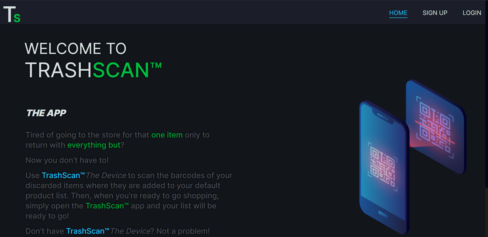

# Trash Scanner&#8482;, the _App_

## Screenshot



## Table of Contents

- [`Description`](#description)
- [`Usage`](#usage)
  - [`PWA Installation`](./docs/installation/installation.md#pwa-installation-instructions)
  - [`Using the App on a Desktop Device`](./docs/upload-picture-desktop/upload-desktop-readme.md#how-to-use-the-app-on-a-desktop-device)
- [`How to Contribute`](#how-to-contribute)
- [`Contact`](#contact)
- [`License`](#license)

## Description

**Trash Scanner**&#8482;, the _Device_, provides users an inexpensive way to track the items they throw away so that they can be repurchased with ease. This was a request from a family member and the user story for the scanner is as follows:

```txt
I want a device near my trash can

So that I can scan the bar codes of the grocery items I am discarding in the trash.

I want to be able to access the list of discarded items on my phone or computer

So that I can view them later for purchasing.
```

**Trash Scanner**&#8482;, the _App_, is a progressive web application that provides the UI for the remaining user requirements. Ideally, **Trash Scanner**&#8482;, the _App_, should be used with **Trash Scanner**&#8482;, the _Device_. But the app has been expanded for general-purpose use and provides a bar code scanner via your device's camera as a back-up.

In the preliminary stages, **Trash Scanner**&#8482;, the _App_ has been implemented around the following user story and needs:

```txt
When I sign in as an authenticated user, I am taken to my dashboard.

Where I can create, view, edit, and delete item-lists.

I want to be able to name my lists and know when it was created or last updated.

Scanned items from Trash Scanner the device should automatically appear as an item in my default list, or a list I have designated as a default list.

If a default list doesn't exist then one should be created automatically so that I do not lose track of any items.

Barcode data should be translated automatically, and I should be able to add in the necessary information if it can't be found.

I want to be able to indicate an item isn't needed without removing it from the list, like a check mark or something similar.

```

## Usage

**Trash Scanner**&#8482;, the _App_ can be accessed at [`https://iitoneloc.github.io/trashscanner-web-app/`](https://iitoneloc.github.io/trashscanner-web-app/) and is a _Progressive Web Application_ or **PWA**. This means that the app can be installed to your device via the browser, as a glorified shortcut, while retaining the look, feel, and functionality of a traditional application without the need for using a device-specific marketplace.

> Please note that not all browsers support this functionality, Firefox is a prime example. However the application is installable in chrome based browsers like Microsoft Edge, Google Chrome, Brave, etc, as well as Safari.

### PWA Installation Instructions

[`View the instructions here`](./docs/installation/installation.md#pwa-installation-instructions)

### Application Usage Instructions

[`Using the app on a computer`](./docs/upload-picture-desktop/upload-desktop-readme.md#how-to-use-the-app-on-a-desktop-device)

## How to Contribute

If you have ideas for improving **Trash Scanner**&#8482;, the _App_, or you wish to contribute to the project please feel free to send me an email!

## Contact

If you have any questions please feel free to email me @ [`anthonytropeano@protonmail.com`](mailto:anthonytropeano@protonmail.com)

## License

This product is not licensed for reuse at this time.

© 2023 Anthony Tropeano

[`Back to Top`](#screenshot)
