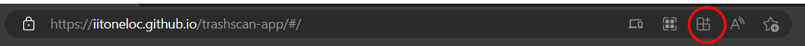
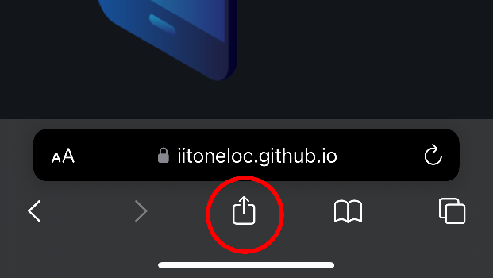
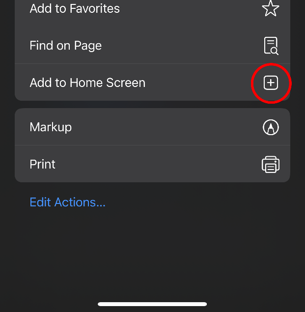
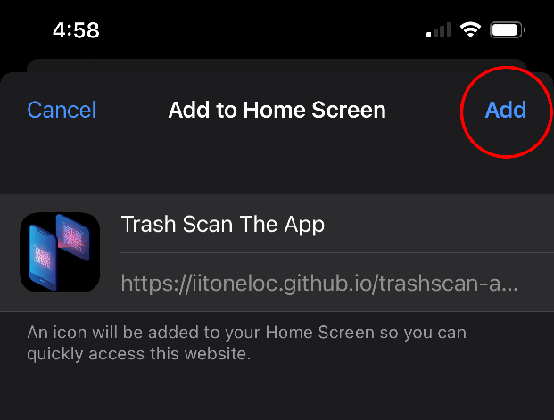

# PWA Installation Instructions

## On Desktop

An installable icon will appear but this will look different depending on your browser, a few examples have been listed below:

### Chrome/Brave

### Edge

After locating the correct icon, click on it, then click on `Install`

An icon for the app will be added to your desktop and will look like the one below:

---

## On Mobile

### Apple Devices

Even if Safari isn't the default browser on your device, you must use Safari to install the PWA.

**Click on the link:**

[`https://iitoneloc.github.io/trashscan-app/`](https://iitoneloc.github.io/trashscan-app/)

**Click on the share icon located by the address bar:**

**Click on `Add to Home Screen`:**

**Click on `Add` to confirm**

### Android Devices

For chrome based browsers you can refer to google's documentation as I do not have an Android device.

[`Android Installation`](https://support.google.com/chrome/answer/9658361?hl=en&co=GENIE.Platform%3DAndroid&oco=0)

---

## Go Back to

[`README - Usage`](../../README.md#usage)

[`README`](../../README.md#screenshot)
