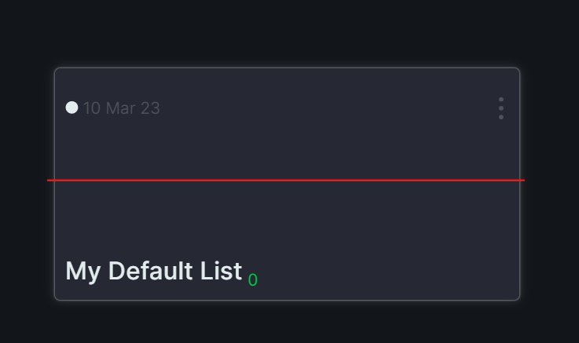
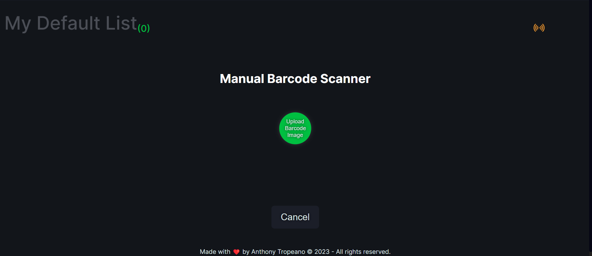
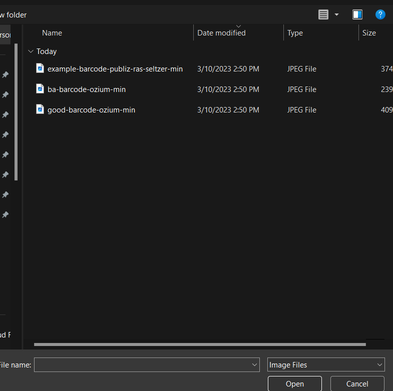
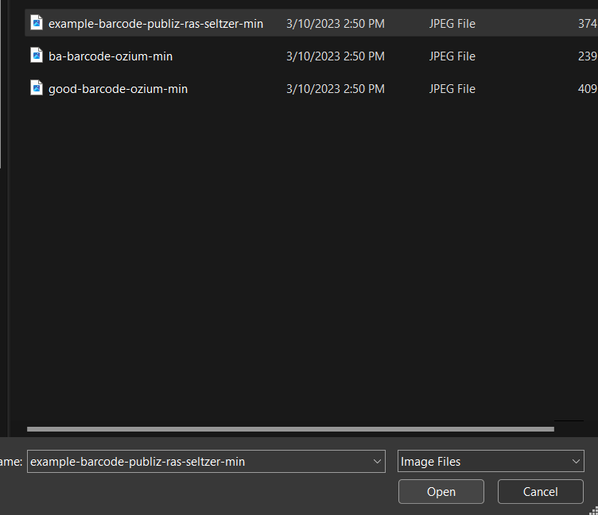
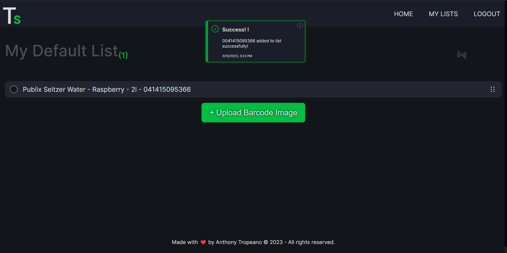
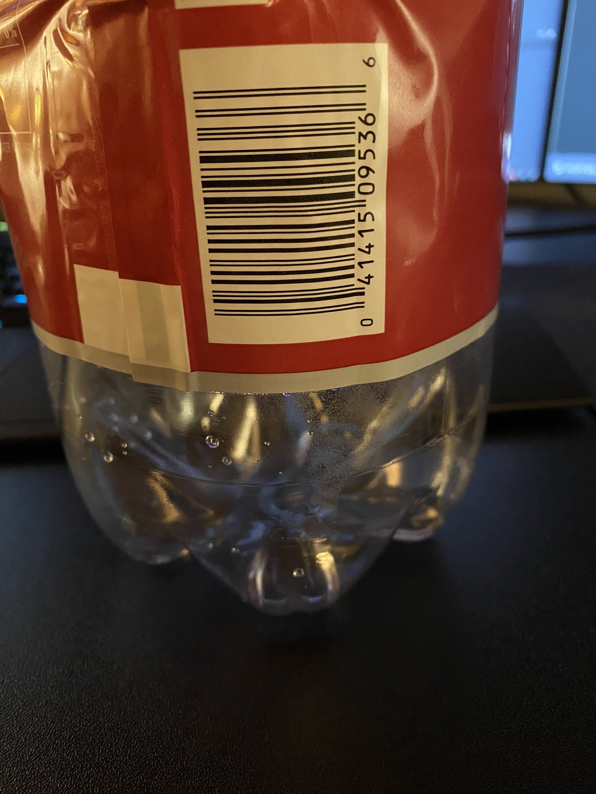
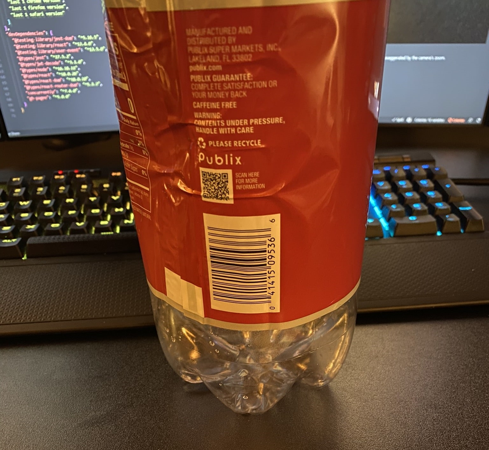
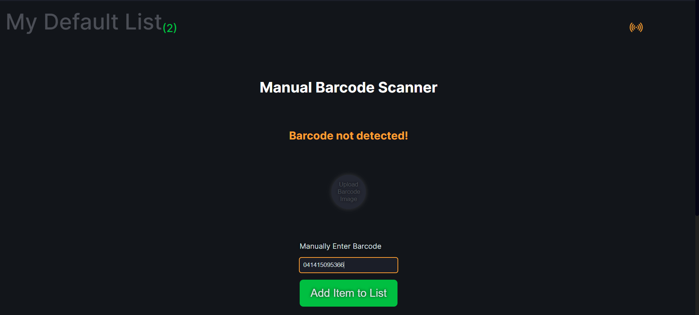

# Accessing Lists and Adding Items

To access a particular list. Double click on the top half portion of the card, or anywhere at or above the imaginary red line in the image below. The three dots in the upper right hand corner of this card provides a drop-down menu which will be discussed in a later section:

## Figure 1

_Opening a List_

Once you have opened your desired list, you can begin to add items.

If you are using a TrashScanner&#8482; then any barcode scanned with the device will appear in your default list.

If you are not using a stand alone device items can be added manually by clicking on the `+ Upload Barcode Image` button, which is always at the end of your list.

Once you have clicked on the button you will be taken to the upload view where we can continue by clicking on `Upload Barcode Image` button in the center of the page. This button is greyed out until a mouse hovers over it. If you wish to go back click on the `Cancel` button.

## Figure 2

_Uploading Barcode Image_

> Note: The yellow icon towards the top of the page is always there but greyed out when live updates from the Scanner are not enabled. All this does is poll for new data every 5 seconds and the state can be toggled by clicking on the icon. It will automatically be turned on by the previous step to ensure your list data stays current and will turn itself off after the scan has been completed.

Clicking on the button launches the file explorer:

## Figure 3

_File Explorer_

> Note a [`good barcode image`](./images/good-barcode-min.jpeg) can be downloaded here for testing purposes, and is the same image used in Figure 4 below:

Where you can select your desired image.

## Figure 4

_Image Selection_

Click on `Open` to upload the image for barcode extraction.

If the extraction was successful you should see a success response like the one below:

If the extraction wasn't successful it might not be your fault! The barcode extraction from images is still a work in progress.

To ensure that barcode can be extracted we have to help the algorithm find the it. This can be done by setting your camera's zoom to at least 2x zoom before taking a picture. Additionally try to get just the barcode if possible. What I have noticed is the spacing between the barcode lines needs to be exaggerated as this seems to be where it gets confused.

## Image Examples for Barcode Extraction

### Figure 5

_Acceptable Barcode Example_

> Notice: How the spacing between the barcode lines has been exaggerated by the camera's zoom.

### Figure 6

_Unacceptable Barcode Example_

> Notice: How the spacing on the barcode is much closer together? A barcode captured like this won't be captured.

### Manual Entry

The first time a barcode isn't extracted the option is provided to enter the barcode information manually. You could of course click on `Upload Barcode Image` to try a different picture if you wished but this may be a faster solution:

### Figure 7

_Manual Barcode Entry After Unsuccessful Extraction_

> Note: Only valid 12 Digit UPCs or 13 Digit EANs are currently accepted via the image scanner's manual entry.

### Back To

[`How to Use the App on a Desktop Device`](./upload-desktop-readme.md#how-to-use-the-app-on-a-desktop-device)

[`README`](../../README.md#screenshot)
