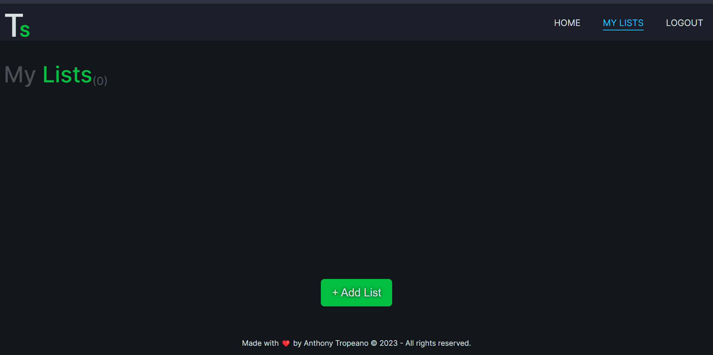
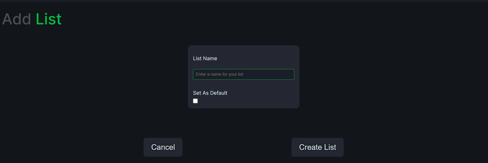
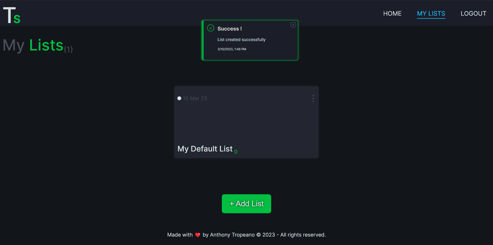

# How To Use The App On a Desktop Device

## Table of Contents

- [`Create A Default List`](#create-a-default-list)
- [`Accessing Lists and Adding Items`](./access-list-and-adding-items.md#accessing-lists-and-adding-items)
- [`Back to README`](../../README.md#table-of-contents)

## Login or Create an Account

The first step in this process is pretty simple and will leave this up to you.

## Create a Default List

When using TrashScan&#8482; _The Device_, or a TrashScanner&#8482;, the scanner will create a default list in the application for the user if one doesn't already exist. However, a default list is not created when a new account is created.

If not using the scanner or you don't want to rename the list later you can create one manually.

After you have logged in or created an account, you will be taken to the default view. This view is like a dashboard where you can create, view, edit, or delete lists.

To make sure you are in the right location, you can check the navigation bar on the top right of the page. `My Lists` should be blue and underlined. If your page doesn't look like Figure 1 below, click on the My lists navigation link in your browser to navigate to the correct location.

### Figure 1

_My Lists - Default View_

Now that we are in the right place, click on the green `+ Add List` button. You should see a form like the one in Figure 2:

### Figure 2

_Add List Form_

Enter a name for your list.

Names must have at least three characters. Make sure you click the box below `Set As Default` to designate this as a default list.

> Note: This isn't actually required if you are not using the standalone scanner for barcode scanning, but setting this won't break anything or cause any weird issues.

Click on the green `Create List` button on the bottom right of the page to create the list. If there were no errors you should see a similar looking screen:

> Note: If the `Create List` button is not green and is still greyed out, then ensure your list name meets the requirements and try again.

### Figure 3

_Example of a successful creation_

> Note: Pop up messages act like modals in the sense that they block page interaction until the message has been dismissed. Messages can be cleared manually by clicking on the `X` icon in the upper right hand corner of the alert, but they will clear on their own after a set amount of time. The time varies but is usually around 7.5 seconds.

### Next to

[`Accessing Lists and Adding Items`](./access-list-and-adding-items.md#accessing-lists-and-adding-items)

### Go Back to

[`README`](../../README.md#screenshot)

[`README - USAGE`](../../README.md#usage)
